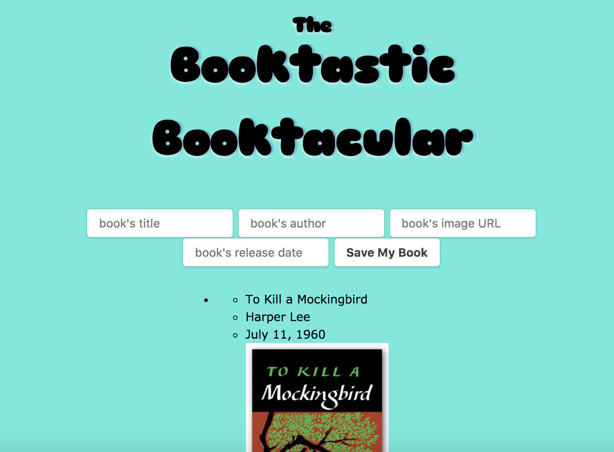

<!--
title: Practicing AJAX
type: Lab
duration: "1:25"
creator:
    name: Micah Rich
    city: LA
competencies: Front-end intro
-->

# Practicing AJAX

## Introduction

> ***Note:*** _Please lean on your neighbors throughout this process.  If you are seeing the same error for more than 15 minutes, that's a good time to ask your peers for help._

You're about to write a lot of AJAX-backed JavaScript – using jQuery – that will complete our little book app.

Make use of the fantastic and well-read https://super-crud.herokuapp.com/books.  Your task is to use your JS skills to list out all the books in our database and get our form working so we can add more.

## Exercise

#### Requirements

- Implement a jQuery AJAX client for a simple REST service
- Build an application that uses AJAX to update a client
- Use form submission and AJAX to interact with an API on the web.

#### Starter Code

You'll find the same starter code you had in the last lesson in the `starter-code` folder. It's a basic `index` and some styling, along with an empty `app.js`.

> Note: If you are having trouble getting started, look back at your work on the [jQuery MadLib Lab](https://github.com/den-materials/css-html-forms-lab).

> Note: Remember what the `event.preventDefault();` line does?  If not, check it out on Google.  It is vital in this lab.

#### Deliverable

1. Make a list of existing books appear underneath the form.
2. Make the form work (i.e. it will add a book, and you can verify the book was added by refreshing).
3. Get your app to add to the list of books without refreshing the page, using the information from the newly created book.

## Additional Resources

- [http://youmightnotneedjquery.com](http://youmightnotneedjquery.com/)
- [jQuery AJAX Docs](http://api.jquery.com/jquery.ajax/)
- [Some useful jQuery DOM Manipulation Docs](http://api.jquery.com/prepend/)
- [Super CRUD API](https://github.com/SF-WDI-LABS/super-crud-api)
